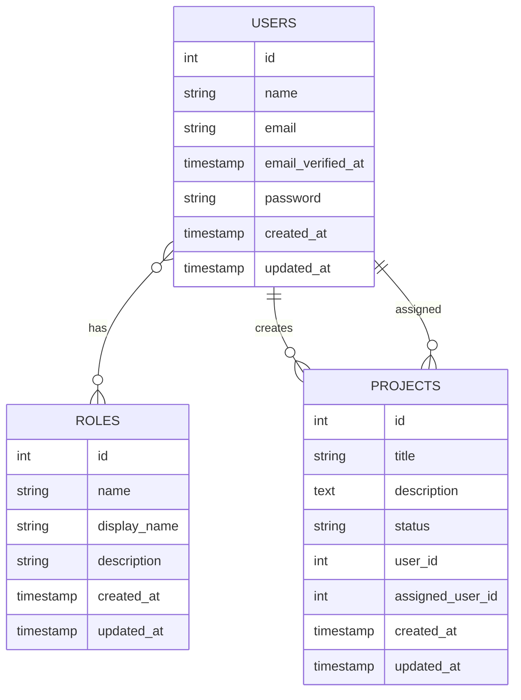

Voici un README professionnel pour votre projet SecureBoard :

```markdown
# 🚀 SecureBoard - Modern Project Management Platform


**SecureBoard** est une application moderne de gestion de projets et d'utilisateurs, conçue pour optimiser les workflows d'équipe avec une architecture performante et sécurisée.

## ✨ Features

### 🔐 Authentication & Security
- **Multi-role authentication** (User, Manager, Admin)
- **JWT Token-based security** with Laravel Sanctum
- **Role-based access control** with Laratrust
- **Policies & Gates** for fine-grained permissions
- **Secure password management** with Breeze

### 📊 Project Management
- **Full CRUD operations** for projects
- **Project assignment system** with user tracking
- **Real-time status updates** (Pending, In Progress, Completed)
- **Advanced filtering** by status and assignment
- **Ownership-based permissions**

### 👥 User Management
- **Admin user management** (Create, Read, Update, Delete)
- **Role assignment system**
- **Profile management** for all users
- **Dashboard analytics** based on user role

### ⚡ Performance Optimization
- **Queue system** for asynchronous notifications
- **Event-driven architecture** for better scalability
- **Redis caching** for improved performance
- **Optimized database queries** with eager loading

## 🛠 Tech Stack

### Backend
- **Laravel 10** - PHP Framework
- **Laravel Breeze** - Authentication scaffolding
- **Laravel Sanctum** - API Authentication
- **Laratrust** - Roles & Permissions management
- **Redis** - Queue and Cache driver
- **MySQL** - Database

### Frontend
- **React 18** - User Interface
- **Axios** - HTTP Client
- **React Router** - Navigation
- **Context API** - State management

## 📦 Installation

### Prerequisites
- PHP 8.2+
- Composer
- Node.js 16+
- MySQL 8.0+
- Redis Server

### Backend Setup
```bash
# Clone the repository
git clone https://github.com/yourusername/secureboard.git
cd secureboard

# Install PHP dependencies
composer install

# Setup environment
cp .env.example .env
php artisan key:generate

# Configure database in .env
DB_DATABASE=secureboard
DB_USERNAME=your_username
DB_PASSWORD=your_password

# Configure Redis for queues
REDIS_CLIENT=predis
QUEUE_CONNECTION=redis

# Run migrations and seeding
php artisan migrate --seed

# Generate Laravel Sanctum keys
php artisan sanctum:install

# Link storage
php artisan storage:link

# Start queue worker (in separate terminal)
php artisan queue:work

# Serve application
php artisan serve
```

### Frontend Setup
```bash
# Navigate to frontend
cd resources/js

# Install dependencies
npm install

# Build for development
npm run dev

# Or build for production
npm run build
```

## 🚀 Usage

### User Roles

#### 👤 Regular User
- View assigned projects
- Update personal profile
- Track project progress

#### 👨‍💼 Manager
- Create and manage projects
- Assign projects to users
- Monitor team progress
- Generate project reports

#### 👑 Administrator
- Full user management
- System configuration
- Access to all analytics
- Role and permission management

### API Endpoints

| Method | Endpoint | Description | Access |
|--------|----------|-------------|---------|
| POST | `/api/login` | User authentication | Public |
| POST | `/api/register` | User registration | Public |
| GET | `/api/projects` | List projects | Authenticated |
| POST | `/api/projects` | Create project | Manager+ |
| GET | `/api/projects/{id}` | Get project details | Owner/Admin |
| PUT | `/api/projects/{id}` | Update project | Owner/Admin |
| DELETE | `/api/projects/{id}` | Delete project | Owner/Admin |
| GET | `/api/users` | List users | Admin only |
| POST | `/api/users` | Create user | Admin only |

## 🔧 Configuration

### Environment Variables
```env
APP_URL=http://localhost:8000
FRONTEND_URL=http://localhost:3000

DB_CONNECTION=mysql
DB_HOST=127.0.0.1
DB_PORT=3306
DB_DATABASE=secureboard
DB_USERNAME=root
DB_PASSWORD=

REDIS_HOST=127.0.0.1
REDIS_PASSWORD=null
REDIS_PORT=6379

QUEUE_CONNECTION=redis

MAIL_MAILER=smtp
MAIL_HOST=mailpit
MAIL_PORT=1025
MAIL_USERNAME=null
MAIL_PASSWORD=null
MAIL_ENCRYPTION=null
```

### Queue Setup
```bash
# Start Redis server
redis-server

# Run queue worker
php artisan queue:work --sleep=3 --tries=3

# For production use supervisor
sudo nano /etc/supervisor/conf.d/laravel-worker.conf
```

## 📊 Database Schema



## 🧪 Testing

```bash
# Run PHPUnit tests
php artisan test

# Run feature tests
php artisan test --testsuite=Feature

# Run browser tests
php artisan dusk
```

## 📈 Performance Tips

1. **Use Redis for caching**:
```php
php artisan config:cache
php artisan route:cache
php artisan view:cache
```

2. **Optimize autoload**:
```bash
composer dump-autoload -o
```

3. **Use queue workers** for heavy operations:
```bash
php artisan queue:work --daemon
```

## 🤝 Contributing

1. Fork the project
2. Create your feature branch (`git checkout -b feature/AmazingFeature`)
3. Commit your changes (`git commit -m 'Add some AmazingFeature'`)
4. Push to the branch (`git push origin feature/AmazingFeature`)
5. Open a Pull Request

## 📄 License

This project is licensed under the MIT License - see the [LICENSE.md](LICENSE.md) file for details.

## 🆘 Support

For support, please email support@secureboard.com or join our Slack channel.

## 🙏 Acknowledgments

- Laravel team for the amazing framework
- React team for the frontend library
- Redis for performance optimization
- All contributors who helped shape this project

---

**SecureBoard** - Modern Project Management © 2024 - Built with ❤️ by Your Team
```

